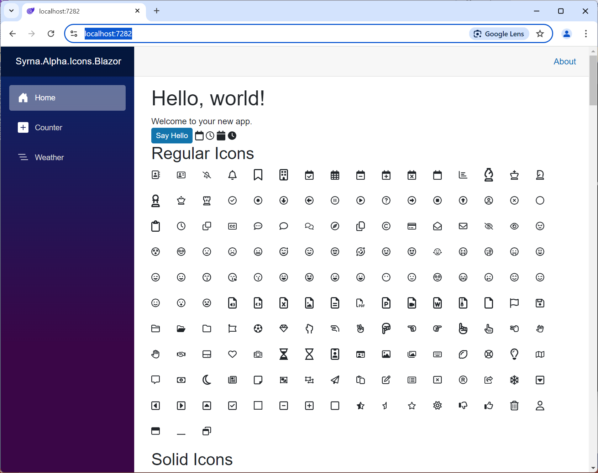

# FontAwesomeFree.TelerikUI
Provides the Font Awesome Free icon library packaged as Telerik Blazor Custom Icon library

## Usage

```html
<TelerikSvgIcon Icon="FontAwesomeFreeRegular.Calendar"></TelerikSvgIcon>
<TelerikSvgIcon Icon="FontAwesomeFreeRegular.Clock"></TelerikSvgIcon>

<TelerikSvgIcon Icon="FontAwesomeFreeSolid.Calendar"></TelerikSvgIcon>
<TelerikSvgIcon Icon="FontAwesomeFreeSolid.Clock"></TelerikSvgIcon>

<TelerikSvgIcon Icon="FontAwesomeFreeBrands.Microsoft"></TelerikSvgIcon>

<TelerikButton OnClick="@SayHelloHandler" ThemeColor="@(ThemeConstants.Button.ThemeColor.Primary)" Icon="FontAwesomeFreeSolid.Baby"></TelerikButton>

```

## Screen Shot


## Thanks & References

Used same methods from https://github.com/kyleherzog/Blazicons

Used free sets provided by https://fontawesome.com/

Use Custom SVG Icon Collection article https://docs.telerik.com/blazor-ui/common-features/icons#use-custom-svg-icon-collection

## About Roslyn Generators


https://github.com/dotnet/roslyn/blob/main/docs/features/incremental-generators.cookbook.md

https://github.com/ByronMayne/SourceGenerator.Foundations

https://github.com/thinktecture/article-roslyn-source-generators

https://dominikjeske.github.io/source-generators/

https://github.com/efonsecab/PTIMicroservicesGenerators

https://github.com/AnderssonPeter/TestSourceGenerator
